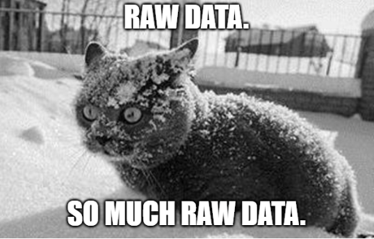

# Black Ops 4 Source

Dump of some parts of BO4 using [Atian Call of Duty Tools](https://github.com/ate47/atian-cod-tools), please create an issue on the tools directory if you find a strange decompiled code.

## Pools

Pools dumped ([List of all the pools](https://github.com/ate47/t8-atian-menu/blob/master/docs/notes/xassetpools.csv))

| name                    | id  |        path                         |
|-------------------------|-----|-------------------------------------|
| localize                | 17  | EMPTY                               |
| weapon                  | 20  | `/tables/weapon/`                   |
| weapontunables          | 22  | `/tables/weapontunables/`           |
| customizationtable      | 30  | `/tables/customization/`            |
| aitype                  | 38  | `/tables/aitype/[origin]/`          |
| rawfile                 | 41  | `/`                                 |
| stringtable             | 43  | `/`                                 |
| structuredtable         | 44  | `/`                                 |
| ddl                     | 46  | `/`                                 |
| scriptparsetree         | 48  | `/`                                 |
| scriptparsetreedbg      | 49  | EMPTY                               |
| scriptparsetreeforced   | 50  | `/tables/scriptparsetreeforced/`    |
| keyvaluepairs           | 51  | `/tables/keyvaluepairs/`            |
| typeinfo                | 62  | EMPTY                               |
| scriptbundle            | 63  | `/scriptbundle/`                    |
| scriptbundlelist        | 64  | `/scriptbundle/list/`               |
| ttf (names)             | 76  | `/tables/ttf.csv`                   |
| bgcache                 | 85  | `/bgcache/`                         |
| maptable                | 89  | `/tables/map/`                      |
| maptablelist            | 90  | `/tables/map/list/`                 |
| maptableloadingimages   | 91  | `/tables/map/loadingimages/`        |
| maptablepreviewimages   | 92  | `/tables/map/previewimages/`        |
| objective               | 94  | `/tables/objective/[origin]/`       |
| luadebug                | 104 | EMPTY                               |
| playerrolecategory      | 109 | `/tables/playerrolecategory/`       |
| playerrolecategorytable | 110 | `/tables/playerrolecategory/table/` |
| gametypetable           | 113 | `/tables/gametype/`                 |
| unlockableitem          | 116 | `/tables/unlockableitem/`           |
| unlockableitemtable     | 117 | `/tables/unlockableitem/table/`     |
| playlists               | 119 | `/tables/playlists/`                |
| hierarchicaltasknetwork | 126 | `/tables/hierarchicaltasknetwork/`  |
| storagefile             | 128 | `/tables/storagefile/`              |
| storagefilelist         | 129 | `/tables/storagefile/list/`         |
| charmixer               | 130 | EMPTY                               |
| storeproduct            | 131 | `/tables/store/product/`            |
| storecategory           | 132 | `/tables/store/category/`           |
| storecategorylist       | 133 | `/tables/store/category/list/`      |
| rank                    | 134 | `/tables/rank/`                     |
| ranktable               | 135 | `/tables/rank/table/`               |
| prestige                | 136 | `/tables/prestige/`                 |
| prestigetable           | 137 | `/tables/prestige/table/`           |
| labelstore              | 143 | `/tables/labelstore/`               |
| labelstorelist          | 144 | `/tables/labelstore/list/`          |
| \<unused\>              | 151 | EMPTY                               |
| rawstring               | 157 | `/strings.csv`                      |
| streamkey               | 159 | `/tables/streamkey/`                |
| sprayorgestureitem      | 165 | `/tables/sprayorgesture/`           |
| sprayorgesturelist      | 166 | `/tables/sprayorgesture/list/`      |

## Names

All the dumped files in the path `/` are using the correct name, if a file name is unknown, the file is put in the `hashed/[pool]` directory. (where `[pool]` is the file origin)

## CSV extraction

Most of the CSV are extracted without the header, you can have some known or guessed header in the [CSV_HEADER.MD](CSV_HEADER.MD) file.

- cells starting with a `#` are hashed. an empty cell with a `#` are empty hashed cells
- cells starting with a `?` are from unknown types.

## Hashes

Thanks to these people for the hashes.

- Serious and the others from the [t8-src](https://github.com/shiversoftdev/t8-src) repository.
- Scobalula and the others from the [Greyhound package index](https://github.com/Scobalula/GreyhoundPackageIndex) repository.
- Richkiller, we wish him all the best where he can be.
- Jek47
- Luisete2105 (Congrat for the matryoshkas)
- All the others I forgot to mention.
